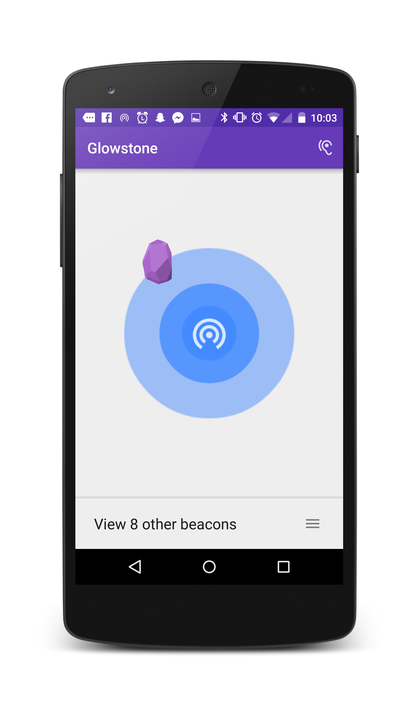
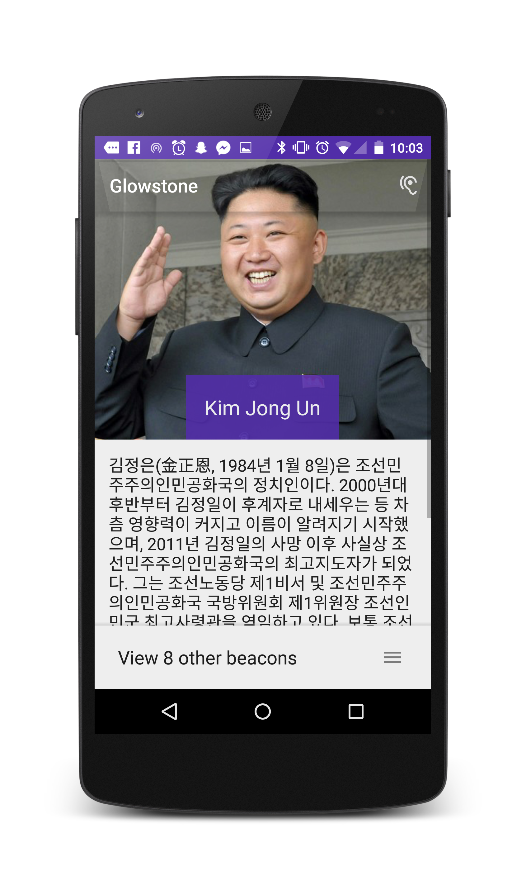
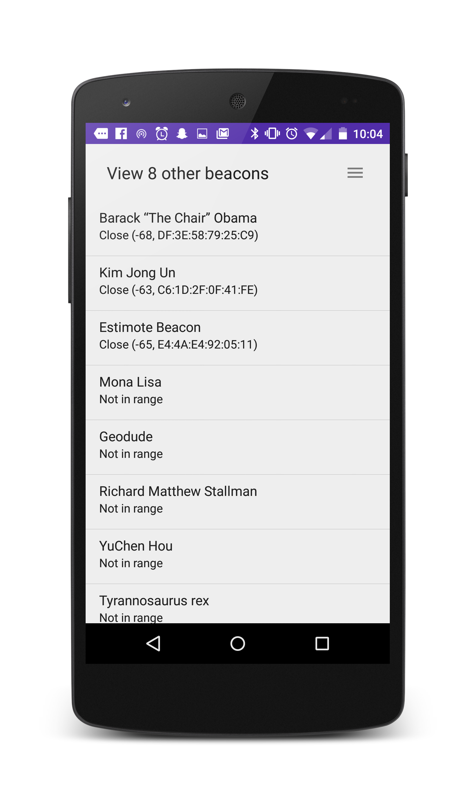

# The Glowstone Project (Android)

IoT application that provides real-time contextual information about the world around you. Don't know how large the ENIAC was? Use a glowstone! Unsure if the CN Tower's architect was a scientologist? Use a glowstone! Curious about the technological intricacies that differ between 2-ply and 3-ply toilet paper? Use a glowstone!

